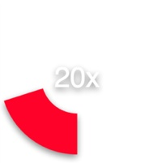
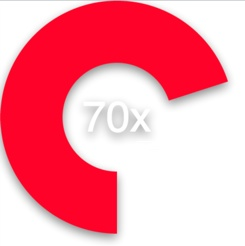
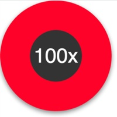

#ProgressCircle.js
ProgressCircle.js is a javascript class for animating circular progress bars via SVG. It makes generating circular progress meters in your HTML easy without relying on any extra frameworks.

Note: This requires support for 'window.requestAnimationFrame()' thus make sure you map the vendor prefixes and / or supply the polyfill in your global space. One of these days we'll stop having to do this, but until then please take note :(

(Luckily it works just fine in Chrome)



Check out the [Demo](http://crossproduct.github.io/ProgressCircle/)
##How it works
Load the .js ...

```
<script src="ProgressCircle.js"></script>
```
Build a home for a ```<path>``` element in your own styling.

```
<div style="width:450px; height:450px;">
	<svg	id="progress-canvas" xmlns="http://www.w3.org/2000/svg"
			xmlns:xlink="http://www.w3.org/1999/xlink" version="1.1">
	    <path id="progress" d="M0,0" fill="none"></path>
	</svg>
	<div style="color:#FFFFFF; text-align: center; position:absolute;top:0; font-family:sans-serif"></div>
</div>
```
Initialize an instance of ```ProgressCircle``` and call ```start()```

```
<script>
	window.onload = function() {
		(progressCircle1 = new ProgressCircle()).init({
			circle: document.getElementById('progress'),
			duration: 6000,
			startAngle: 90,
			stroke: '#FF1133',
			strokeWidth: 120,
			fill: '#333333',
			useLabel: true,
			stopValue: 1,
			unit: 'x',
			scaleFont: true,
			direction: -1,
			callback: null
		});

		// start the animation
		progressCircle1.start();
	};
</script>
```
##Options
Initialization of a ProgressCircle takes an object that holds properties about the circle to draw. Some are required, some are optional with defaults.

name | type | description
------------- | ------------- | -------------
```circle```  | DOMElement ```<path>``` | A reference to the ```<path>``` DOMElement to which the svg data will append on the 'd' attribute.
```duration``` | integer (optional, default is 1000)| The total time of the animation described in milliseconds
```startAngle``` | integer (optional, default is 0) | The angle at which to start the animation. You can specify any integer and it will be auto modulused by 360
```stroke``` | string (optional, default ```#EFEFEF```) | The color of the progress circle.
```strokeWidth``` | integer (optional, default 1) | The width of the progress circle.
```fill``` | (optional, default 'none') | When the stopValue is set to 1, i.e. a full circle, this value will be used to set the fill attribute. Values are a hex color string or 'none'.
```useLabel``` | boolean (optional, default false) | Whether or not to show the label annotation.
```stopValue``` | float (optional, default 1) | A value between ```[0,1]``` indicating what percentage from startAngle to stop.
```unit``` | string (optional, default '') | A string representing a unit type to be appened to the label if used.
```maxLabelValue``` | float (optional, default 100) | A number representing the max value to be mapped for the progress label. The percentage is translated into a function of this value.
```scaleFont``` | boolean (optional, default true) | If the label is to be displayed, this value allows the font-size to be autoscaled.
```direction``` | integer (optional, default 1) | Evaluated as an integer, a negative value indicates counter clockwise, else clockwise
```trackColor``` | string (optional) | The color, and thus presence, of a track underneath the progress.
```strokeLinecap``` | string (optional) | A valid stroke-linecap value for the head and tail of the progress circle.
```easing``` | string (optional) | Apply an easing function to the animation. Can be of the following: ```easeInQuad, easeOutQuad, easeInOutQuad, easeInCubic, easeOutCubic, easeInOutCubic, easeInQuart, easeOutQuart, easeInOutQuart, easeInQuint, easeOutQuint, easeInOutQuint, easeInExpo, easeOutExpo, easeInOutExpo```
```callback``` | function (optional, default null) | A user specified function to be called upon completion of progress circle.


##A Few Functions...
After you've inited your progress circle, there are a few functions of interest that you can call.

function | parameter | description
------------- | ------------- | -------------
start() | *none* | Starts animation.
set() | float | Sets the direct value of the progres circle between ```[0,1]```.
animateTo() | float | Animates to the specified value.
reset() | *none* | Resets the display and instance values of the progress circle.


##License
The MIT License (MIT)

Copyright (c) 2014 Chris Ross , crossproduct iNc.

Permission is hereby granted, free of charge, to any person obtaining a copy
of this software and associated documentation files (the "Software"), to deal
in the Software without restriction, including without limitation the rights
to use, copy, modify, merge, publish, distribute, sublicense, and/or sell
copies of the Software, and to permit persons to whom the Software is
furnished to do so, subject to the following conditions:

The above copyright notice and this permission notice shall be included in all
copies or substantial portions of the Software.

THE SOFTWARE IS PROVIDED "AS IS", WITHOUT WARRANTY OF ANY KIND, EXPRESS OR
IMPLIED, INCLUDING BUT NOT LIMITED TO THE WARRANTIES OF MERCHANTABILITY,
FITNESS FOR A PARTICULAR PURPOSE AND NONINFRINGEMENT. IN NO EVENT SHALL THE
AUTHORS OR COPYRIGHT HOLDERS BE LIABLE FOR ANY CLAIM, DAMAGES OR OTHER
LIABILITY, WHETHER IN AN ACTION OF CONTRACT, TORT OR OTHERWISE, ARISING FROM,
OUT OF OR IN CONNECTION WITH THE SOFTWARE OR THE USE OR OTHER DEALINGS IN THE
SOFTWARE.
